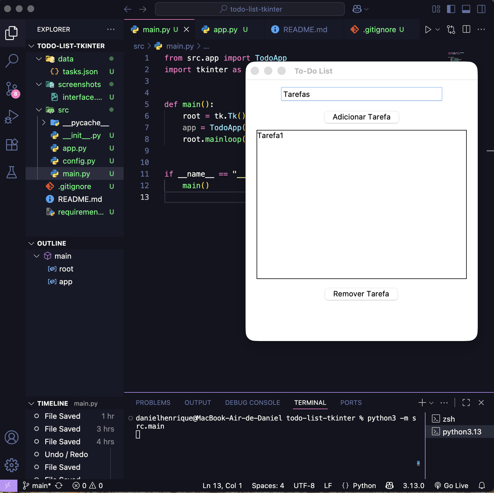

# To-Do List com Interface Gráfica (Tkinter)
Aplicação desktop desenvolvida em Python utilizando Tkinter, com foco em boas práticas
de organização de código, experiência do usuário e persistência de dados.
# Demonstração

# Funcionalidades
- Adicionar tarefas
- Remover tarefas
- Persistência de dados em arquivo JSON
- Interface gráfica simples e intuitiva
- Atalho de teclado (Enter para adicionar tarefa)
# Tecnologias utilizadas
- Python 3
- Tkinter
- JSON
# Estrutura do projeto
O projeto segue uma organização modular, separando:
- Ponto de entrada (`main.py`)
- Lógica da aplicação (`app.py`)
- Configurações (`config.py`)
- Dados persistentes (`tasks.json`)
# macOS / Linux
```bash
python3 -m src.main# todo-list-tkinter
